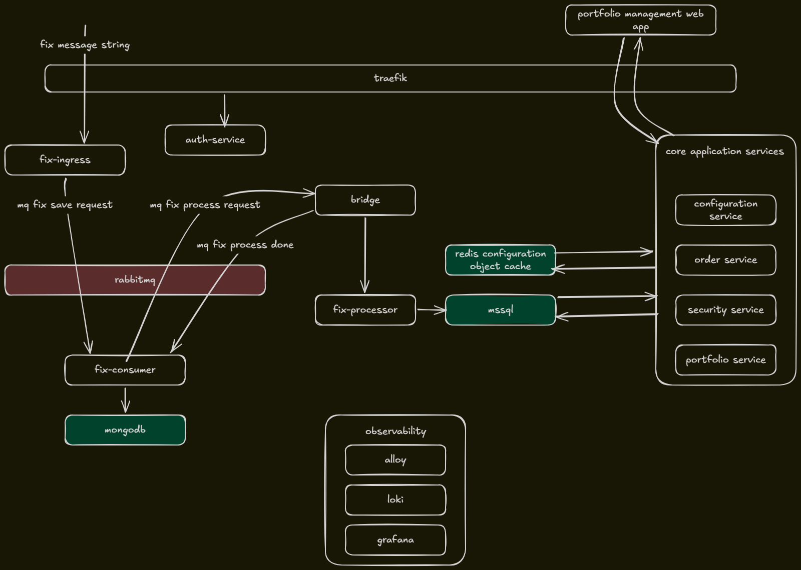

# architecture-solution

A learning project exploring how to compose a polyglot, distributed
trading system around two very different communication paradigms — **asynchronous,
message-driven ingestion** and **synchronous, transactional processing** — and the
service that bridges them.

The goal is not the trading domain itself but the architecture around it: clear
service boundaries, an edge gateway with centralized auth, durable messaging, and
observability.

> **Status:** work in progress. The diagram below shows the *intended* end state.
> The FIX ingestion pipeline (ingress → queue → consumer → bridge → processor) and
> the edge/auth/observability layers exist today; the core application services and
> configuration cache on the right are planned.

## How it works (intended)

**Edge & auth.** All external traffic enters through **Traefik**. The `auth-service`
issues tokens (`/token`) and backs a `forwardauth` middleware (`/verify`) that gates
protected routes, injecting `X-Auth-Subject` / `X-Auth-Roles` headers downstream so
services never handle credentials directly.

More about this decision in [ADR 0001: Trusting the `X-Auth-Subject` header](docs/adr/0001-trust-x-auth-subject-header.md).

**Async ingestion.** A raw FIX message string is posted to `fix-ingress`, which
validates it and publishes to RabbitMQ (`fix_messages_ingress`). `fix-consumer`
persists the raw message to **MongoDB** and emits a process request
(`fix_messages_process`).

**The bridge.** `bridge` is the connector between the two worlds: it consumes the
async process request from RabbitMQ and makes a **synchronous** HTTP call to
`fix-processor`. `fix-processor` parses the message and writes the structured trade
into **MSSQL** transactionally. On success the bridge publishes a confirmation
(`fix_messages_confirmation`), which `fix-consumer` uses to mark the original
document processed — closing the loop without coupling the two sides.

**Core application services (planned).** A cluster of services
(configuration, order, security, portfolio) serves the **portfolio management web
app** over Traefik, reading trade data from MSSQL and shared configuration from a
**Redis** cache.

**Observability.** Logs and telemetry flow into **Alloy → Loki → Grafana**, kept on
a separate network and out of the request path.

## Testing

Testing currently centers on `fix-test/`, a Rust load/smoke script that drives the
full ingestion path end to end: it authenticates against `auth-service` for a token,
then generates synthetic FIX messages and posts them through Traefik to `fix-ingress`
under that token. More tests are planned, starting with focused coverage of the
`auth-service` (token issuance and forward-auth verification).

## Layout

| Path | What |
|------|------|
| `fix-backend/` | Go services: `fix-ingress`, `fix-consumer`, shared MQ/model code |
| `core-backend/` | .NET services: `Bridge`, `FixProcessor`, `TradeData` (EF Core / MSSQL), shared models |
| `auth-service/` | Go token issuer + forward-auth verifier |
| `observability/` | Alloy, Loki, Grafana config |
| `fix-test/` | Rust load/smoke test driving the ingestion path end to end |
| `docs/adr/` | Architecture decision records |
| `docker-compose.yml` | Local orchestration of the whole stack |
